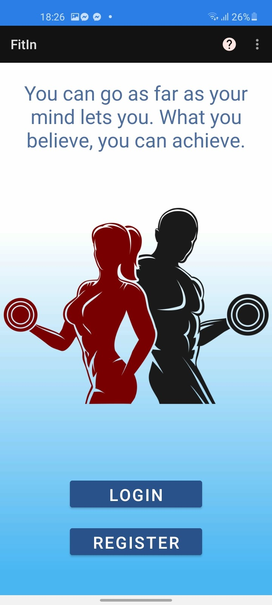
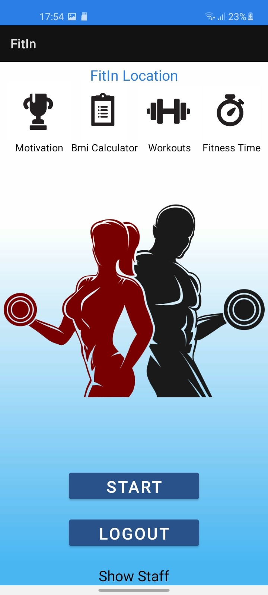
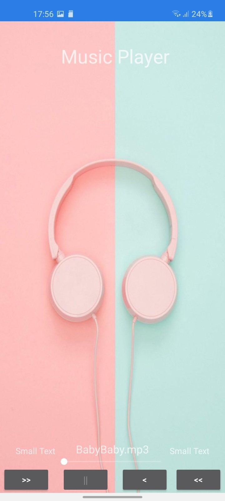
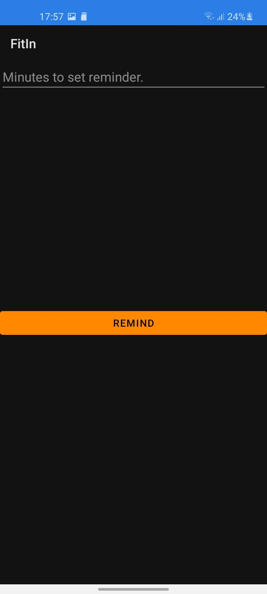
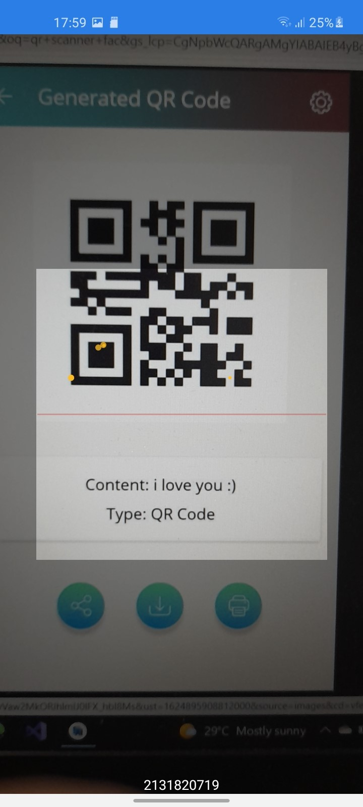
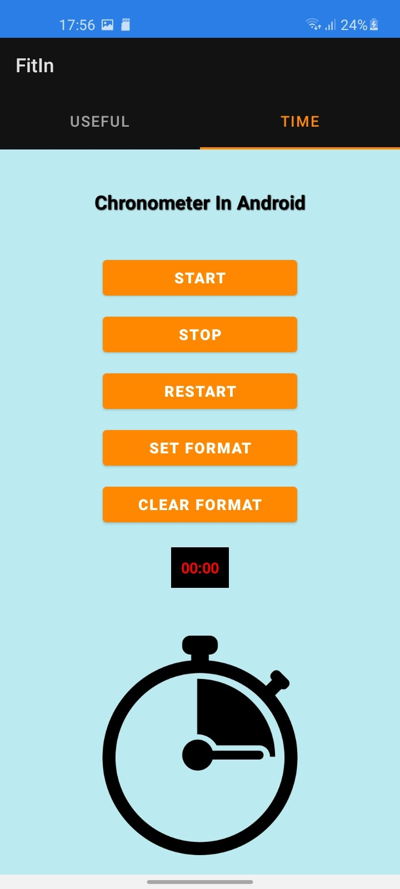
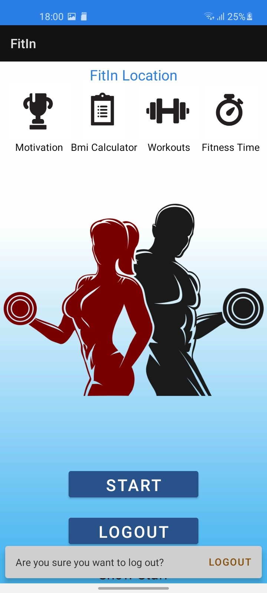

# MobileApp - FitIn
Ky aplikacion eshte ndertuar nga gjuha programuese Java.
## Tabela e Permbajtjes
* [Hyrje](#hyrje)
* [Librarite](#librarite)
* [Funksionet](#funksionet)
* [Ilustrimi](#ilustrimi)
* [Instalimi](#instalimi)
## Hyrje
FitIn eshte ndertuar per paisjet mobile Android.
FitIn eshte nje aplikacion fitnesi qe na ndihmon qe te i kryejm ushtrimet ne menyre te rregullt.Nder funksionet tjera FitIn gjithashtu posedon edhe nje Reminder, Skanues i kodeve te ndryshme(Qr code,bar code etj), Music Player, disa Programe te ushtrimeve ,Kronometer, Bmi calculator, Map etc.
Fillimisht perdoruesi duhet te regjistrohet e me pas te logohet ne menyre qe te mund te i perdor funksionet e ketij aplikacioni, perdoruesi gjithashtu ka mundesi qe ta ndryshoje passwordin.
## Librarite
Ne kete projekt jane perdorur keto librari te jashtme:
*   'androidx.appcompat:appcompat:1.3.0'
*   'com.google.android.material:material:1.3.0'
*   'androidx.constraintlayout:constraintlayout:2.0.4'
*   'androidx.legacy:legacy-support-v4:1.0.0'
*   'com.google.firebase:firebase-auth:21.0.1'
*   'com.google.firebase:firebase-bom:28.0.1'
*   'com.google.firebase:firebase-analytics'
*   'com.tomer:fadingtextview:2.5'
*   'com.tomer:fadingtextview:2.5'
*   'com.google.android.gms:play-services-maps:17.0.1'
*   'androidx.viewpager:viewpager:1.0.0'
*   'androidx.coordinatorlayout:coordinatorlayout:1.1.0'
*   'junit:junit:4.+'
*   "androidx.viewpager:viewpager:1.0.0"
*   'com.github.bumptech.glide:glide:4.11.0'
*   "androidx.browser:browser:1.3.0"
*   'com.android.volley:volley:1.2.0'
*   'com.journeyapps:zxing-android-embedded:3.4.0'
*   'androidx.test.ext:junit:1.1.2'
*   'androidx.test.espresso:espresso-core:3.3.0'
*   'com.android.support:design:30.0.3'
*   'com.google.maps.android:android-maps-utils:2.2.3'
*   'com.google.maps.android:maps-utils-ktx:2.4.0'
## Fuksionet
Ky projekt permban keto funksione:
* BMI calculator;
* Kronometer;
* Reminder;
* Music Player;
* Skaner i kodeve te ndryshme;
* Shfaqja e Stafit
* Programi i ushtrimeve
* Ushtrimet
* FitIn location(Map)
* Shfaqja e figures permes Async Task
## Ilustrimi

* Main: Main activity eshte aktiviteti i cili na hapet ne fillim dhe kemi dy opsione ku mund te regjistrohemi dhe te logohemi ne aplikacion.Dhe gjithashtu paraqiten edhe thenje ne forme te animacioneve.

* Regjistrimi: Aktiviteti i regjistrimit duket si ne figuren me poshte, ku duhet te mbushen fushat e Name, LastName, Email, Phone Number dhe Password( i cli duhet te kete 6 e me shume karaktere se paku nje numer nje shkronje te madhe dhe nje nga simbolet ne vijim (@#$%^&+=.) dhe gjithashtu nuk duhet te kete hapsira. Te dhenat ruhen ne nje databaze te brendshme.

* Login: Aktiviteti i login duket si ne figuren me poshte, ku duhet te mbushen fushat e Email dhe Password. Keto te dhena kontrollohen ne databazen e brendshme nese jane te regjistruara, nese nuk jane te regjistruara paraqitet nje mesazh se nuk ekziston ky perdoures. Nese jane te regjistruara na drejton ne aktivitetin e radhes.

* Change your password: Aktiviteti PasswordChanger mund te jete i qaseshem nga login aktiviteti( nuk duhet te jesh i loguar) duhet te plotesohen 3 fusha Email, OldPassword dhe NewPassword. Ne menyre qe te ndryshohet passwordi kontrollohet ne databaze dhe gjithashtu kontrollohet edhe passwordi i ri nese i ploteson kushtet e nevojshme dhe me pas ndryshohet ne databaze.

* Fitness: Pasi te logohemi ne drejtohemi tek fitness aktiviteti i cili na jep mundesine qe te qasemi tek vetite e ketij aplikacioni dhe duket si me poshte.

* Google Maps: Nga aktiviteti fitness ne klikojm tek teksti FitIn Location ku neve na paraqitet Google Maps me clustering dhe gjithashtu mund te kerkojme(Search) nje qytet, shtet etj.

* Motivation: Me klikimin e figures Motivation ne dergon ne AsyncTask, ku...................

* BMI Calculator: Me klikimin ne figuren BMI Calculator ne drejtohemi tek BMI aktiviteti ku kemi mundesi qe te japim gjatesine dhe peshen tone ne menyre qe ta kuptojme nese kemi ne perputhje peshen me gjatesine.

* Workouts: Me klikimin ne figuren Workouts ne drejtohemi tek workouts aktiviteti ku kemi mundesi qe ne forme te sllajdeve te shohim se si duhet te behen ushtrimet.

* FitnessTime: Me klikimin ne figuren FitnessTime ne drejtohemi tek aktiviteti si me poshte ku kemi mundesine e zgjedhjes ne dy tabs Usefull dhe Time. Ku te useful gjendet MusicPlayer, Reminder dhe Code Scanner kurse tek Time gjendet kronometri.

* MusicPlayer: Me klikimin ne figuren Music ne drejtohemi tek aktiviteti music si me poshte ku kemi mundesi qe te degjojme muzike nga aplikacioni edhe nese nuk jemi ne aplikacion.

* Reminder: Me klikimin ne figuren Reminder ne drejtohemi tek aktiviteti Reminder si me poshte ku kemi mundesi qe te shenojme minutat pas te cileve na vie nje reminder ne notification per te ushtruar.

* Code Scanner: Me klikimin ne figuren Scan ne drejtohemi tek aktiviteti i Skanerit si me poshte ku kemi mundesi qe te skanojme qfardo kodi dhe te marrim te dhenat e kodit.
  

* Time: Me klikimin ne tabin Time ne drejtohemi tek aktiviteti i Time si me poshte ku kemi mundesi qe te perdorim kronometrin dhe te matim kohen.

* Start: Me klikimin ne butonit Start ne dritaren ku mund te perdorim sherbimet e aplikacionit neve na drejton tek aktiviteti workout program ku kemi mundesi qe te zgjedhim njerin nga programet e ushtrimeve nga 5 sosh.

* Show Staff: Me klikimin ne tekstin Show Staff ne drejtohemi tek aktiviteti staff ku paraqitet stafi i fitnesit FitIn ku gjithashtu ne kete aktivitet behet edhe parsimi i JSON.

* Logout: Me klikimin e butonit Logout neve na paraqitet nje Snackbar ku na pyet edhe njeher nese deshirojme qe te dalim nga aplikacioni.

## Instalimi
Ky aplikacion duhet te klonohet apo te behet download dhe me pas te lidhet me nje lidhje fizike ndermjet PC dhe nje telefoni Android qe te mund te instalohet ne telefon, ose mund edhe te simulohet virtualisht nga Android Studio.
